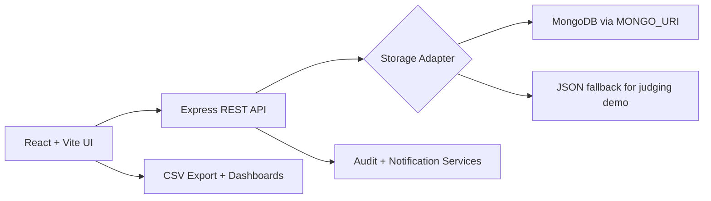

# GoalOS - AtomQuest Hackathon 1.0

GoalOS is a MERN-style Goal Setting & Tracking Portal built for the AtomQuest Hackathon 1.0 brief. It supports employee goal creation, L1 manager approval, locked goal sheets, shared departmental KPIs, quarterly achievements, manager check-ins, reports, dashboards, audit logs, and bonus analytics/escalation/notification surfaces.

## Run Locally

```bash
npm install
npm run dev
```

Open `http://127.0.0.1:5173`.

The backend runs at `http://127.0.0.1:5050`. If `MONGO_URI` is set, data is stored in MongoDB. Without it, the app uses a local JSON store so the demo works immediately.

## Demo Roles

Use the role switcher in the top bar:

- Employee: Asha Verma
- Manager: Rohan Mehta
- Admin / HR: Nisha Rao

## Hackathon Coverage

- Goal creation with thrust area, title, description, UoM, target, weightage, min/max/timeline/zero scoring logic.
- Validation: total weightage must equal 100%, minimum goal weightage is 10%, maximum eight goals.
- L1 approval workflow with inline target and weightage edits, return for rework, and lock on approval.
- Shared departmental KPIs pushed by manager/admin to multiple employees with recipient-only weightage edits.
- Quarterly update interface for actual achievements and status.
- Manager check-ins with structured comments and completion tracking.
- CSV achievement report export.
- Completion dashboard, audit trail, unlock workflow, escalation queue, notification log, and analytics charts.

## Architecture



## Cost-Aware Hosting

- Frontend: Vercel/Netlify static hosting.
- API: Render/Fly.io/Azure App Service free or low-cost tier.
- Database: MongoDB Atlas shared tier.
- The JSON fallback keeps local demos cheap and reliable; production should use MongoDB.
